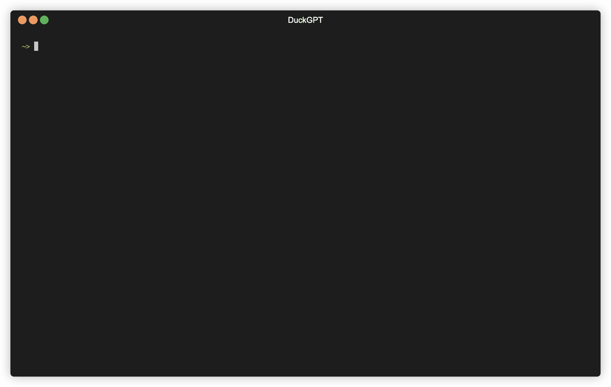
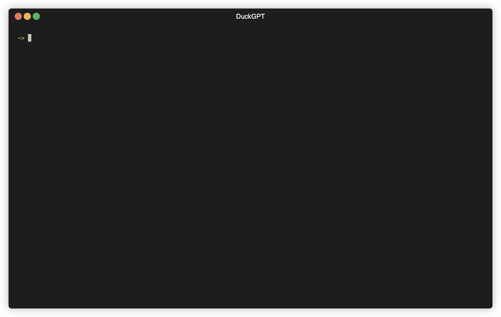

# DuckGPT

DuckGPT lets you ask questions about your JSON and CSV files, then answers them by composing SQL queries using [ChatGPT](https://platform.openai.com/docs/models/gpt-3-5) and executing them through [DuckDB](https://duckdb.org).

Disclaimer: This is a toy project. ChatGPT likes to hallucinate weird queries occasionally, but most of the time, it works surprisingly well! Including the way it's able to automatically respond to errors in queries it writes, and then rewrite them correctly.



## Installation

You can install it using Homebrew:
```bash
brew tap cube2222/cube2222
brew install duckgpt
```
or download one of the static binaries from the releases page. If you're downloading a static binary, make sure to install DuckDB as well.

## Usage
Provide your OpenAI platform key through the DUCKGPT_TOKEN environment variable. Then, you can run duckgpt in the directory that contains your JSON and/or CSV files.

## Demo

You've seen one demo at the beginning of the README, now we can take a look at another example, where one of the queries DuckGPT writes is incorrect (at least in the DuckDB SQL dialect). It then rewrites it correctly, without any user interaction.



Finally, we can turn on debug mode to see the raw messages being exchanged between DuckGPT and ChatGPT.


## Closing Thoughts

Have fun!
